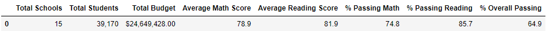
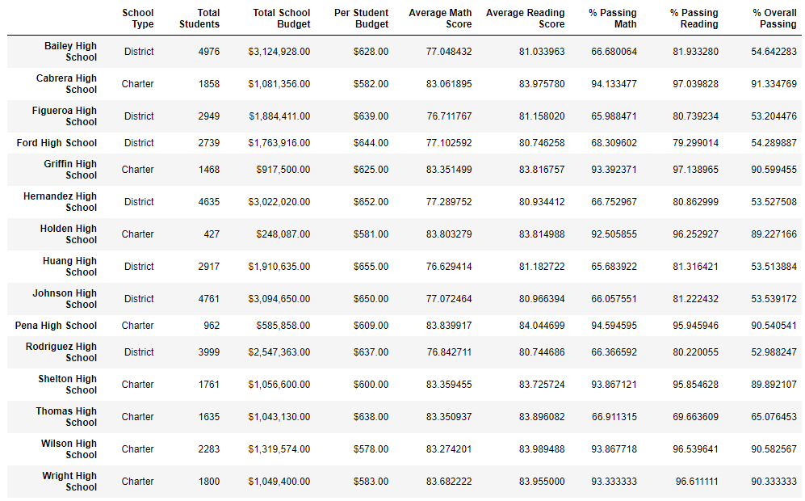
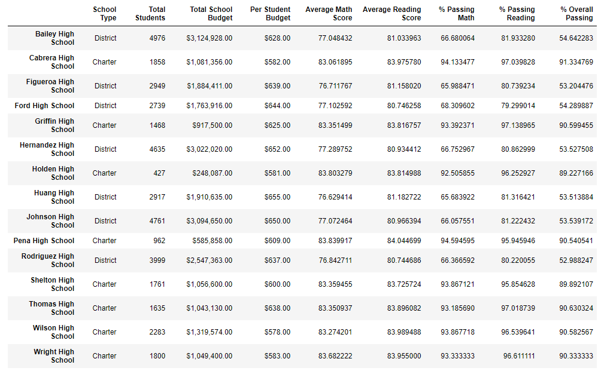
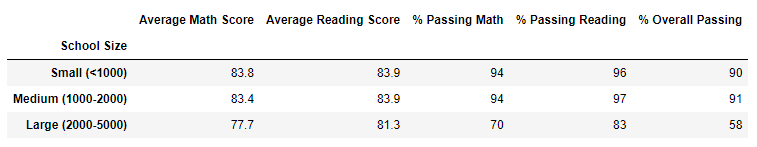
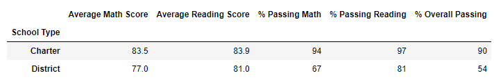

# School_District_Analysis

## Overview of school district analysis
This project was meant to show how python can be used to remove errant data and redisplay with pandas for analysis using data frames. 

### Purpose
In this project it was requested that the data for the 9th grade students at Thomas High School was removed due to concerns about it's legitimacy. First I imported two csv files and displayed their data in data frames. 
I used conditionals to determine which students were in 9th grade and in Thomas High School and replaced math and reading scores with a null value using a pandas function. Then I adjusted the student count by subtracting 
the number of students with null values from the total student count and recalculating the averages. I created a new data frame composed of school type, student number, budget, budget per student, average math student, % passing math,
% passing reading, and % passing overall and formatted the values appropriately.  I then provided further information for analysis including a breakdown of best performing schools, and a breakdown of best performing schools. In addition to 
this I created a breakdown of scores of schools by spending, size, and type using bins. 

## Results

* How is the district summary affected?

	The district summary would improve slightly because the change in grades at Thomas High School improved as a result of the replacement. It would not have a particularly 	large impact on this value because the analysis is on 15 total schools.

* How is the school summary affected?

	Thomas High School dramatically improved after the replacement.

Before replacement:

After replacement:

* How does replacing the ninth graders’ math and reading scores affect Thomas High School’s performance relative to the other schools?

	Thomas High School moved from 9th place to 7th place in math, from last place to 3rd place in reading, and from 8th place to 2nd in overall pass rate.

* How does replacing the ninth-grade scores affect the following:

	Math and reading scores by grade
	The ninth grade scores improved slightly for both math and reading.

	Scores by school spending
	The third bin (spending range from $615 to $645) improved after replacement.	

	Scores by school size
	The medium sized schools improved after replacement.
	

	Scores by school type
The charter schools improved after replacement.

## Summary
 Thomas High School is a charter school with 1635 students from 9th to 12th grade.  It also has a budget of $638 per student. When the 9th grade grades were replaced by all scores for the school were improved. This means that the average math score, the average reading score, the percent passing math score and the percent passing reading score all improved.  The scores associated with charter schools and medium sized schools also improved as a result. 
